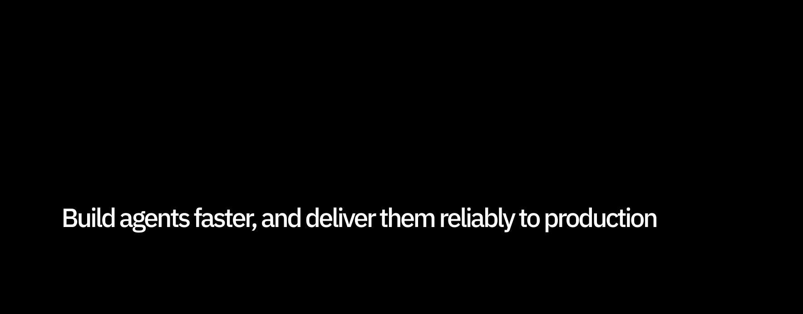
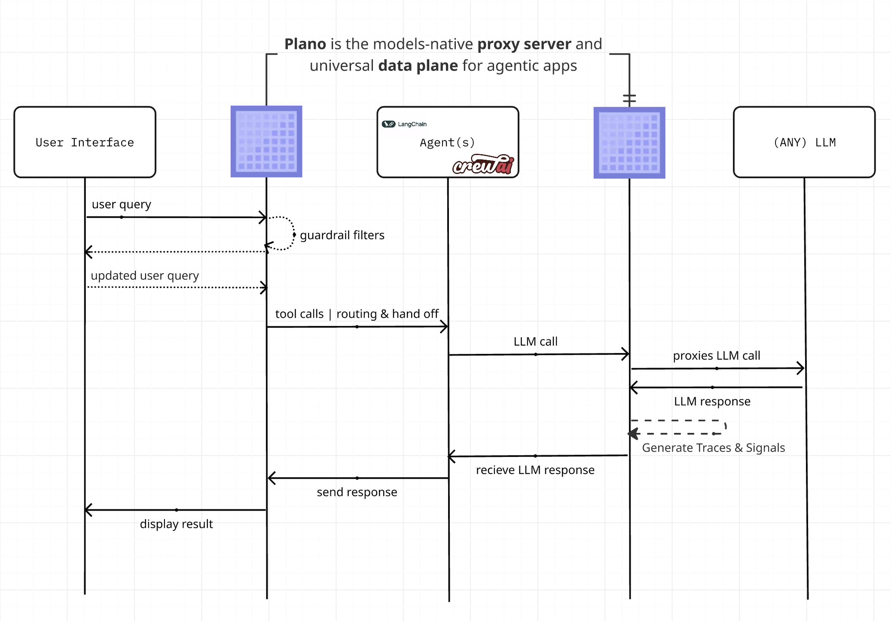

<div align="center">
  
</div>
<div align="center">

 _Plano is a models-native proxy server and data plane for agents._<br><br>
 Plano pulls out the rote plumbing work and decouples you from brittle framework abstractions, centralizing what shouldn’t be bespoke in every codebase - like agent routing and orchestration, rich agentic signals and traces for continuous improvement, guardrail filters for safety and moderation, and smart LLM routing APIs for UX and DX agility. Use any language or AI framework, and deliver agents faster to production.


[Quickstart](#Quickstart) •
[Route LLMs](#use-plano-as-a-llm-router) •
[Build Agentic Apps with Plano](#Build-Agentic-Apps-with-Plano) •
[Documentation](https://docs.planoai.dev) •
[Contact](#Contact)

[](https://github.com/katanemo/plano/actions/workflows/pre-commit.yml)
[](https://github.com/katanemo/plano/actions/workflows/rust_tests.yml)
[](https://github.com/katanemo/plano/actions/workflows/e2e_tests.yml)
[](https://github.com/katanemo/plano/actions/workflows/static.yml)

</div>

# Overview
Building agentic demos is easy. Shipping agentic applications safely, reliably, and repeatably to production is hard. After the thrill of a quick hack, you end up building the “hidden middleware” to reach production: routing logic to reach the right agent, guardrail hooks for safety and moderation, evaluation and observability glue for continuous learning, and model/provider quirks scattered across frameworks and application code.

Plano solves this by moving core delivery concerns into a unified, out-of-process dataplane.

- **🚦 Orchestration:** Low-latency orchestration between agents; add new agents without modifying app code.
- **🔗 Model Agility:** Route [by model name, alias (semantic names) or automatically via preferences](#use-plano-as-a-llm-router).
- **🕵 Agentic Signals&trade;:** Zero-code capture of [behavior signals](#observability) plus OTEL traces/metrics across every agent.
- **🛡️ Moderation & Memory Hooks:** Build jailbreak protection, add moderation policies and memory consistently via [Filter Chains](https://docs.planoai.dev/concepts/filter_chain.html).

Plano pulls rote plumbing out of your framework so you can stay focused on what matters most: the core product logic of your agentic applications. Plano is backed by [industry-leading LLM research](https://planoai.dev/research) and built on [Envoy](https://envoyproxy.io) by its core contributors, who built critical infrastructure at scale for modern worklaods.

**High-Level Network Sequence Diagram**:


**Jump to our [docs](https://docs.planoai.dev)** to learn how you can use Plano to improve the speed, safety and obervability of your agentic applications.

> [!IMPORTANT]
> Plano and the Arch family of LLMs (like Plano-Orchestrator-4B, Arch-Router, etc) are hosted free of charge in the US-central region to give you a great first-run developer experience of Plano. To scale and run in production, you can either run these LLMs locally or contact us on [Discord](https://discord.gg/pGZf2gcwEc) for API keys.

## Contact
To get in touch with us, please join our [discord server](https://discord.gg/pGZf2gcwEc). We actively monitor that and offer support there.

## Quickstart

Follow this quickstart guide to use Plano as a router for local or hosted LLMs, including dynamic routing. Later in the section we will see how you can Plano to build highly capable agentic applications, and to provide e2e observability.

### Prerequisites

Before you begin, ensure you have the following:

1. [Docker System](https://docs.docker.com/get-started/get-docker/) (v24)
2. [Docker compose](https://docs.docker.com/compose/install/) (v2.29)
3. [Python](https://www.python.org/downloads/) (v3.13)

Plano's CLI allows you to manage and interact with the Plano gateway efficiently. To install the CLI, simply run the following command:

> [!TIP]
> We recommend that developers create a new Python virtual environment to isolate dependencies before installing Plano. This ensures that plano and its dependencies do not interfere with other packages on your system.

```console
$ python3.12 -m venv venv
$ source venv/bin/activate   # On Windows, use: venv\Scripts\activate
$ pip install plano==0.4.0
```

### Use Plano as a LLM Router
Plano supports multiple powerful routing strategies for LLMs. [Model-based routing](https://docs.arch.com/guides/llm_router.html#model-based-routing) gives you direct control over specific models and supports 11+ LLM providers including OpenAI, Anthropic, DeepSeek, Mistral, Groq, and more. [Alias-based routing](https://docs.arch.com/guides/llm_router.html#alias-based-routing) lets you create semantic model names that decouple your application code from specific providers, making it easy to experiment with different models or handle provider changes without refactoring. For full configuration examples and code walkthroughs, see our [routing guides](https://docs.arch.com/guides/llm_router.html).

#### Policy-based Routing
Policy-based routing provides deterministic constructs to achieve automatic routing. intelligent, dynamic model selection based on natural language descriptions of tasks and preferences. Instead of hardcoded routing logic, you describe what each model is good at using plain English.

```yaml
version: v0.1.0

listeners:
  egress_traffic:
    address: 0.0.0.0
    port: 12000
    message_format: openai
    timeout: 30s

llm_providers:
  - model: openai/gpt-4o
    access_key: $OPENAI_API_KEY
    routing_preferences:
      - name: complex_reasoning
        description: deep analysis, mathematical problem solving, and logical reasoning
      - name: creative_writing
        description: storytelling, creative content, and artistic writing

  - model: deepseek/deepseek-coder
    access_key: $DEEPSEEK_API_KEY
    routing_preferences:
      - name: code_generation
        description: generating new code, writing functions, and creating scripts
      - name: code_review
        description: analyzing existing code for bugs, improvements, and optimization
```

Plano uses a lightweight 1.5B autoregressive model to intelligently map user prompts to these preferences, automatically selecting the best model for each request. This approach adapts to intent drift, supports multi-turn conversations, and avoids brittle embedding-based classifiers or manual if/else chains. No retraining required when adding models or updating policies — routing is governed entirely by human-readable rules.

**Learn More**: Check our [documentation](https://docs.plano.com/concepts/llm_providers/llm_providers.html) for comprehensive provider setup guides and routing strategies. You can learn more about the design, benchmarks, and methodology behind preference-based routing in our paper:

<div align="left">
  <a href="https://arxiv.org/abs/2506.16655" target="_blank">
    
  </a>
</div>

### Build Agentic Apps with Plano

Plano helps you build agentic applications in two complementary ways:

- **Orchestrate agents**: Let Plano decide which agent or LLM should handle each request and in what sequence.
- **Call deterministic backends**: Use prompt targets to turn natural-language prompts into structured, validated API calls.

You focus on product logic (agents and APIs) while Plano handles routing, parameter extraction, and wiring. The full examples used here are available in the [`plano-quickstart` repository](https://github.com/plano-ai/plano-quickstart).

#### Build agents with Plano orchestration

Agents are where your business logic lives (the "inner loop"). Plano takes care of the "outer loop"—routing, sequencing, and managing calls across agents and LLMs. In this quick example, we show a simplified **Travel Assistant** that routes between a `flight_agent` and a `hotel_agent`.

##### Step 1. Minimal orchestration config

Create a `plano_config.yaml` that wires Plano-Orchestrator to your agents:

```yaml
version: v0.1.0

agents:
  - id: flight_agent
    url: http://host.docker.internal:10520  # your flights service
  - id: hotel_agent
    url: http://host.docker.internal:10530  # your hotels service

model_providers:
  - model: openai/gpt-4o
    access_key: $OPENAI_API_KEY

listeners:
  - type: agent
    name: travel_assistant
    port: 8001
    router: plano_orchestrator_v1
    agents:
      - id: flight_agent
        description: Search for flights and provide flight status.
      - id: hotel_agent
        description: Find hotels and check availability.

tracing:
  random_sampling: 100
```

##### Step 2. Start your agents and Plano

Run your `flight_agent` and `hotel_agent` services (see the [Orchestration guide](https://docs.planoai.dev/guides/orchestration.html) for a full Travel Booking example), then start Plano with the config above:

```console
$ plano up plano_config.yaml
```

Plano will start the orchestrator and expose an agent listener on port `8001`.

##### Step 3. Send a prompt and let Plano route

Send a request to Plano using the OpenAI-compatible chat completions API—the orchestrator will analyze the prompt and route it to the right agent based on intent:

```bash
$ curl --header 'Content-Type: application/json' \
  --data '{"messages": [{"role": "user","content": "Find me flights from SFO to JFK tomorrow"}], "model": "openai/gpt-4o"}' \
  http://localhost:8001/v1/chat/completions
```

You can then ask a follow-up like "Also book me a hotel near JFK" and Plano-Orchestrator will route to `hotel_agent`—your agents stay focused on business logic while Plano handles routing.

#### Deterministic API calls with prompt targets

Next, we'll show Plano's deterministic API calling using a single prompt target. We'll build a currency exchange backend powered by `https://api.frankfurter.dev/`, assuming USD as the base currency.

##### Step 1. Create plano config file

Create `plano_config.yaml` with the following content:

```yaml
version: v0.1.0

listeners:
  ingress_traffic:
    address: 0.0.0.0
    port: 10000
    message_format: openai
    timeout: 30s

llm_providers:
  - access_key: $OPENAI_API_KEY
    model: openai/gpt-4o

system_prompt: |
  You are a helpful assistant.

prompt_targets:
  - name: currency_exchange
    description: Get currency exchange rate from USD to other currencies
    parameters:
      - name: currency_symbol
        description: the currency that needs conversion
        required: true
        type: str
        in_path: true
    endpoint:
      name: frankfurter_api
      path: /v1/latest?base=USD&symbols={currency_symbol}
    system_prompt: |
      You are a helpful assistant. Show me the currency symbol you want to convert from USD.

  - name: get_supported_currencies
    description: Get list of supported currencies for conversion
    endpoint:
      name: frankfurter_api
      path: /v1/currencies

endpoints:
  frankfurter_api:
    endpoint: api.frankfurter.dev:443
    protocol: https
```

##### Step 2. Start Plano with currency conversion config

```sh
$ plano up plano_config.yaml
2024-12-05 16:56:27,979 - cli.main - INFO - Starting plano cli version: 0.4.0
2024-12-05 16:56:28,485 - cli.utils - INFO - Schema validation successful!
2024-12-05 16:56:28,485 - cli.main - INFO - Starting plano model server and plano gateway
2024-12-05 16:56:51,647 - cli.core - INFO - Container is healthy!
```

Once the gateway is up you can start interacting with it at port `10000` using the OpenAI chat completion API.

Some sample queries you can ask include: `what is currency rate for gbp?` or `show me list of currencies for conversion`.

##### Step 3. Interact with the gateway using curl

Here is a sample curl command you can use to interact:

```bash
$ curl --header 'Content-Type: application/json' \
  --data '{"messages": [{"role": "user","content": "what is exchange rate for gbp"}], "model": "none"}' \
  http://localhost:10000/v1/chat/completions | jq ".choices[0].message.content"

"As of the date provided in your context, December 5, 2024, the exchange rate for GBP (British Pound) from USD (United States Dollar) is 0.78558. This means that 1 USD is equivalent to 0.78558 GBP."
```

And to get the list of supported currencies:

```bash
$ curl --header 'Content-Type: application/json' \
  --data '{"messages": [{"role": "user","content": "show me list of currencies that are supported for conversion"}], "model": "none"}' \
  http://localhost:10000/v1/chat/completions | jq ".choices[0].message.content"

"Here is a list of the currencies that are supported for conversion from USD, along with their symbols:\n\n1. AUD - Australian Dollar\n2. BGN - Bulgarian Lev\n3. BRL - Brazilian Real\n4. CAD - Canadian Dollar\n5. CHF - Swiss Franc\n6. CNY - Chinese Renminbi Yuan\n7. CZK - Czech Koruna\n8. DKK - Danish Krone\n9. EUR - Euro\n10. GBP - British Pound\n11. HKD - Hong Kong Dollar\n12. HUF - Hungarian Forint\n13. IDR - Indonesian Rupiah\n14. ILS - Israeli New Sheqel\n15. INR - Indian Rupee\n16. ISK - Icelandic Króna\n17. JPY - Japanese Yen\n18. KRW - South Korean Won\n19. MXN - Mexican Peso\n20. MYR - Malaysian Ringgit\n21. NOK - Norwegian Krone\n22. NZD - New Zealand Dollar\n23. PHP - Philippine Peso\n24. PLN - Polish Złoty\n25. RON - Romanian Leu\n26. SEK - Swedish Krona\n27. SGD - Singapore Dollar\n28. THB - Thai Baht\n29. TRY - Turkish Lira\n30. USD - United States Dollar\n31. ZAR - South African Rand\n\nIf you want to convert USD to any of these currencies, you can select the one you are interested in."
```

## [Observability](https://docs.plano.com/guides/observability/observability.html)
Plano is designed to support best-in class observability by supporting open standards. Please read our [docs](https://docs.plano.com/guides/observability/observability.html) on observability for more details on tracing, metrics, and logs. The screenshot below is from our integration with Signoz (among others)


## Contribution
We would love feedback on our [Roadmap](https://github.com/orgs/katanemo/projects/1) and we welcome contributions to **Plano**!
Whether you're fixing bugs, adding new features, improving documentation, or creating tutorials, your help is much appreciated.
Please visit our [Contribution Guide](CONTRIBUTING.md) for more details
