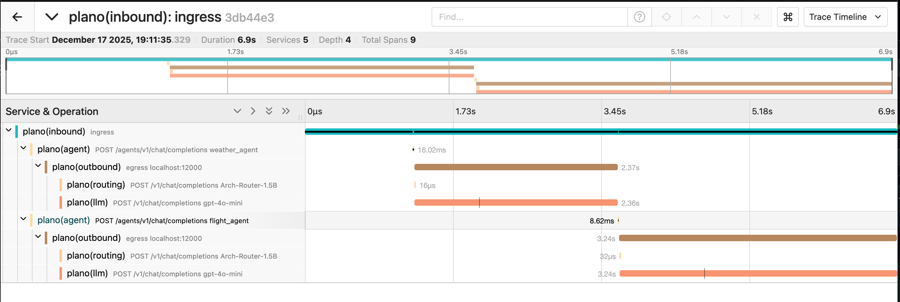

<div align="center">
  
</div>
<div align="center">

 _The AI-native proxy server and data plane for agentic apps._<br><br>
 Plano pulls out the rote plumbing work and decouples you from brittle framework abstractions, centralizing what shouldn’t be bespoke in every codebase - like agent routing and orchestration, rich agentic signals and traces for continuous improvement, guardrail filters for safety and moderation, and smart LLM routing APIs for model agility. Use any language or AI framework, and deliver agents faster to production.


[Quickstart Guide](https://docs.planoai.dev/get_started/quickstart.html) •
[Build Agentic Apps with Plano](#Build-Agentic-Apps-with-Plano) •
[Documentation](https://docs.planoai.dev) •
[Contact](#Contact)

[](https://github.com/katanemo/plano/actions/workflows/ci.yml)
[](https://github.com/katanemo/plano/actions/workflows/docker-push-main.yml)
[](https://github.com/katanemo/plano/actions/workflows/static.yml)

Star ⭐️ the repo if you found Plano useful — new releases and updates land here first.
</div>

# Overview
Building agentic demos is easy. Shipping agentic applications safely, reliably, and repeatably to production is hard. After the thrill of a quick hack, you end up building the “hidden middleware” to reach production: routing logic to reach the right agent, guardrail hooks for safety and moderation, evaluation and observability glue for continuous learning, and model/provider quirks scattered across frameworks and application code.

Plano solves this by moving core delivery concerns into a unified, out-of-process dataplane.

- **🚦 Orchestration:** Low-latency orchestration between agents; add new agents without modifying app code.
- **🔗 Model Agility:** Route [by model name, alias (semantic names) or automatically via preferences](#use-plano-as-a-llm-router).
- **🕵 Agentic Signals&trade;:** Zero-code capture of [Signals](https://docs.planoai.dev/concepts/signals.html) plus OTEL traces/metrics across every agent.
- **🛡️ Moderation & Memory Hooks:** Build jailbreak protection, add moderation policies and memory consistently via [Filter Chains](https://docs.planoai.dev/concepts/filter_chain.html).

Plano pulls rote plumbing out of your framework so you can stay focused on what matters most: the core product logic of your agentic applications. Plano is backed by [industry-leading LLM research](https://planoai.dev/research) and built on [Envoy](https://envoyproxy.io) by its core contributors, who built critical infrastructure at scale for modern worklaods.

**High-Level Network Sequence Diagram**:


**Jump to our [docs](https://docs.planoai.dev)** to learn how you can use Plano to improve the speed, safety and obervability of your agentic applications.

> [!IMPORTANT]
> Plano and the Arch family of LLMs (like Plano-Orchestrator-4B, Arch-Router, etc) are hosted free of charge in the US-central region to give you a great first-run developer experience of Plano. To scale and run in production, you can either run these LLMs locally or contact us on [Discord](https://discord.gg/pGZf2gcwEc) for API keys.

---

## Build Agentic Apps with Plano

Plano handles **orchestration, model management, and observability** as modular building blocks - letting you configure only what you need (edge proxying for agentic orchestration and guardrails, or LLM routing from your services, or both together) to fit cleanly into existing architectures. Below is a simple multi-agent travel agent built with Plano that showcases all three core capabilities

> 📁 **Full working code:** See [`demos/agent_orchestration/travel_agents/`](demos/agent_orchestration/travel_agents/) for complete weather and flight agents you can run locally.


### 1. Define Your Agents in YAML

```yaml
# config.yaml
version: v0.3.0

# What you declare: Agent URLs and natural language descriptions
# What you don't write: Intent classifiers, routing logic, model fallbacks, provider adapters, or tracing instrumentation

agents:
  - id: weather_agent
    url: http://localhost:10510
  - id: flight_agent
    url: http://localhost:10520

model_providers:
  - model: openai/gpt-4o
    access_key: $OPENAI_API_KEY
    default: true
  - model: anthropic/claude-3-5-sonnet
    access_key: $ANTHROPIC_API_KEY

listeners:
  - type: agent
    name: travel_assistant
    port: 8001
    router: plano_orchestrator_v1  # Powered by our 4B-parameter routing model. You can change this to different models
    agents:
      - id: weather_agent
        description: |
          Gets real-time weather and forecasts for any city worldwide.
          Handles: "What's the weather in Paris?", "Will it rain in Tokyo?"

      - id: flight_agent
        description: |
          Searches flights between airports with live status and schedules.
          Handles: "Flights from NYC to LA", "Show me flights to Seattle"

tracing:
  random_sampling: 100  # Auto-capture traces for evaluation
```

### 2. Write Simple Agent Code

Your agents are just HTTP servers that implement the OpenAI-compatible chat completions endpoint. Use any language or framework:

```python
# weather_agent.py
from fastapi import FastAPI, Request
from fastapi.responses import StreamingResponse
from openai import AsyncOpenAI

app = FastAPI()

# Point to Plano's LLM gateway - it handles model routing for you
llm = AsyncOpenAI(base_url="http://localhost:12001/v1", api_key="EMPTY")

@app.post("/v1/chat/completions")
async def chat(request: Request):
    body = await request.json()
    messages = body.get("messages", [])
    days = 7

    # Your agent logic: fetch data, call APIs, run tools
    # See demos/agent_orchestration/travel_agents/ for the full implementation
    weather_data = await get_weather_data(request, messages, days)

    # Stream the response back through Plano
    async def generate():
        stream = await llm.chat.completions.create(
            model="openai/gpt-4o",
            messages=[{"role": "system", "content": f"Weather: {weather_data}"}, *messages],
            stream=True
        )
        async for chunk in stream:
            yield f"data: {chunk.model_dump_json()}\n\n"

    return StreamingResponse(generate(), media_type="text/event-stream")
```

### 3. Start Plano & Query Your Agents

**Prerequisites:** Follow the [prerequisites guide](https://docs.planoai.dev/get_started/quickstart.html#prerequisites) to install Plano and set up your environment.

```bash
# Start Plano
planoai up config.yaml
...

# Query - Plano intelligently routes to both agents in a single conversation
curl http://localhost:8001/v1/chat/completions \
  -H "Content-Type: application/json" \
  -d '{
    "model": "gpt-4o",
    "messages": [
      {"role": "user", "content": "I want to travel from NYC to Paris next week. What is the weather like there, and can you find me some flights?"}
    ]
  }'
# → Plano routes to weather_agent for Paris weather ✓
# → Then routes to flight_agent for NYC → Paris flights ✓
# → Returns a complete travel plan with both weather info and flight options
```

### 4. Get Observability and Model Agility for Free

Every request is traced end-to-end with OpenTelemetry - no instrumentation code needed.



### What You Didn't Have to Build

| Infrastructure Concern | Without Plano | With Plano |
|---------|---------------|------------|
| **Agent Orchestration** | Write intent classifier + routing logic | Declare agent descriptions in YAML |
| **Model Management** | Handle each provider's API quirks | Unified LLM APIs with state management |
| **Rich Tracing** | Instrument every service with OTEL | Automatic end-to-end traces and logs |
| **Learning Signals** | Build pipeline to capture/export spans | Zero-code agentic signals |
| **Adding Agents** | Update routing code, test, redeploy | Add to config, restart |

**Why it's efficient:** Plano uses purpose-built, lightweight LLMs (like our 4B-parameter orchestrator) instead of heavyweight frameworks or GPT-4 for routing - giving you production-grade routing at a fraction of the cost and latency.

---

## Contact
To get in touch with us, please join our [discord server](https://discord.gg/pGZf2gcwEc). We actively monitor that and offer support there.

## Getting Started

Ready to try Plano? Check out our comprehensive documentation:

- **[Quickstart Guide](https://docs.planoai.dev/get_started/quickstart.html)** - Get up and running in minutes
- **[LLM Routing](https://docs.planoai.dev/guides/llm_router.html)** - Route by model name, alias, or intelligent preferences
- **[Agent Orchestration](https://docs.planoai.dev/guides/orchestration.html)** - Build multi-agent workflows
- **[Filter Chains](https://docs.planoai.dev/concepts/filter_chain.html)** - Add guardrails, moderation, and memory hooks
- **[Prompt Targets](https://docs.planoai.dev/concepts/prompt_target.html)** - Turn prompts into deterministic API calls
- **[Observability](https://docs.planoai.dev/guides/observability/observability.html)** - Traces, metrics, and logs

## Contribution
We would love feedback on our [Roadmap](https://github.com/orgs/katanemo/projects/1) and we welcome contributions to **Plano**! Whether you're fixing bugs, adding new features, improving documentation, or creating tutorials, your help is much appreciated. Please visit our [Contribution Guide](CONTRIBUTING.md) for more details

Star ⭐️ the repo if you found Plano useful — new releases and updates land here first.
