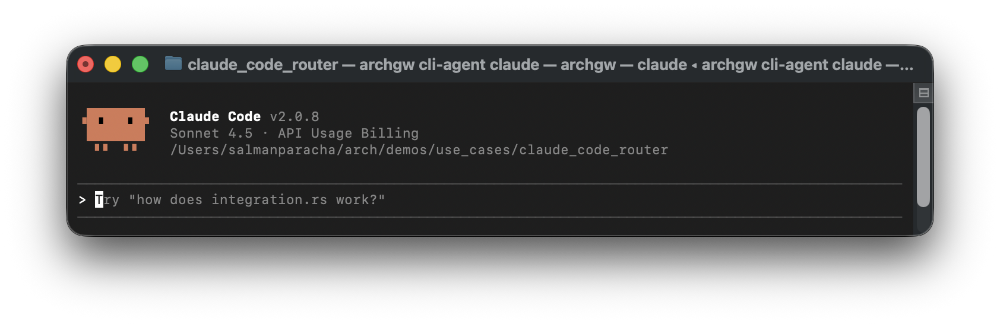

<div align="center">
  
</div>
<div align="center">


_Arch is a models-native (edge and service) proxy server for agents._<br><br>
 Arch handles the *pesky plumbing work* in building AI agents — like applying guardrails, routing prompts to the right agent, generating hyper-rich information traces for RL, and unifying access to any LLM. It’s a language and framework friendly infrastructure layer designed to help you build and ship agentic apps faster.


[Quickstart](#Quickstart) •
[Demos](#Demos) •
[Route LLMs](#use-arch-as-a-llm-router) •
[Build agentic apps with Arch](#Build-Agentic-Apps-with-Arch) •
[Documentation](https://docs.archgw.com) •
[Contact](#Contact)

[](https://github.com/katanemo/arch/actions/workflows/pre-commit.yml)
[](https://github.com/katanemo/arch/actions/workflows/rust_tests.yml)
[](https://github.com/katanemo/arch/actions/workflows/e2e_tests.yml)
[](https://github.com/katanemo/arch/actions/workflows/static.yml)


</div>

# About The Latest Release:
[0.3.17] [Preference-aware multi LLM routing for Claude Code 2.0](demos/use_cases/claude_code_router/README.md) <br>


# Overview
<a href="https://www.producthunt.com/posts/arch-3?embed=true&utm_source=badge-top-post-badge&utm_medium=badge&utm_souce=badge-arch&#0045;3" target="_blank"></a>

AI demos are easy to hack. But once you move past a prototype, you’re stuck building and maintaining low-level plumbing code that slows down real innovation. For example:

- **Routing & orchestration.** Put routing in code and you’ve got two choices: maintain it yourself or live with a framework’s baked-in logic. Either way, keeping routing consistent means pushing code changes across all your agents, slowing iteration and turning every policy tweak into a refactor instead of a config flip.
- **Model integration churn.** Frameworks wire LLM integrations directly into code abstractions, making it hard to add or swap models without touching application code — meaning you’ll have to do codewide search/replace every time you want to experiment with a new model or version.
- **Observability & governance.** Logging, tracing, and guardrails are baked in as tightly coupled features, so bringing in best-of-breed solutions is painful and often requires digging through the guts of a framework.
- **Prompt engineering overhead**. Input validation, clarifying vague user input, and coercing outputs into the right schema all pile up, turning what should be design work into low-level plumbing work.
- **Brittle upgrades**. Every change (new model, new guardrail, new trace format) means patching and redeploying application servers. Contrast that with bouncing a central proxy—one upgrade, instantly consistent everywhere.

With Arch, you can move faster by focusing on higher-level objectives in a language and framework agnostic way. **Arch** was built by the contributors of [Envoy Proxy](https://www.envoyproxy.io/) with the belief that:

>Prompts are nuanced and opaque user requests, which require the same capabilities as traditional HTTP requests including secure handling, intelligent routing, robust observability, and integration with backend (API) systems to improve speed and accuracy for common agentic scenarios  – all outside core application logic.*

**Core Features**:

  - `🚦 Route to Agents`: Engineered with purpose-built [LLMs](https://huggingface.co/collections/katanemo/arch-function-66f209a693ea8df14317ad68) for fast (<100ms) agent routing and hand-off
  - `🔗 Route to LLMs`: Unify access to LLMs with support for [three routing strategies](#use-arch-as-a-llm-router).
  - `⛨ Guardrails`: Centrally configure and prevent harmful outcomes and ensure safe user interactions
  - `⚡ Tools Use`: For common agentic scenarios let Arch instantly clarify and convert prompts to tools/API calls
  - `🕵 Observability`: W3C compatible request tracing and LLM metrics that instantly plugin with popular tools
  - `🧱 Built on Envoy`: Arch runs alongside app servers as a containerized process, and builds on top of [Envoy's](https://envoyproxy.io) proven HTTP management and scalability features to handle ingress and egress traffic related to prompts and LLMs.

**High-Level Sequence Diagram**:


**Jump to our [docs](https://docs.archgw.com)** to learn how you can use Arch to improve the speed, security and personalization of your GenAI apps.

> [!IMPORTANT]
> Today, the function calling LLM (Arch-Function) designed for the agentic and RAG scenarios is hosted free of charge in the US-central region. To offer consistent latencies and throughput, and to manage our expenses, we will enable access to the hosted version via developers keys soon, and give you the option to run that LLM locally. For more details see this issue [#258](https://github.com/katanemo/archgw/issues/258)

## Contact
To get in touch with us, please join our [discord server](https://discord.gg/pGZf2gcwEc). We will be monitoring that actively and offering support there.

## Demos
* [Sample App: Weather Forecast Agent](demos/samples_python/weather_forecast/README.md) - A sample agentic weather forecasting app that highlights core function calling capabilities of Arch.
* [Sample App: Network Operator Agent](demos/samples_python/network_switch_operator_agent/README.md) - A simple network device switch operator agent that can retrieve device statistics and reboot them.
* [Use Case: Connecting to SaaS APIs](demos/use_cases/spotify_bearer_auth) - Connect 3rd party SaaS APIs to your agentic chat experience.

## Quickstart

Follow this quickstart guide to use Arch as a router for local or hosted LLMs, including dynamic routing. Later in the section we will see how you can Arch to build highly capable agentic applications, and to provide e2e observability.

### Prerequisites

Before you begin, ensure you have the following:

1. [Docker System](https://docs.docker.com/get-started/get-docker/) (v24)
2. [Docker compose](https://docs.docker.com/compose/install/) (v2.29)
3. [Python](https://www.python.org/downloads/) (v3.13)

Arch's CLI allows you to manage and interact with the Arch gateway efficiently. To install the CLI, simply run the following command:

> [!TIP]
> We recommend that developers create a new Python virtual environment to isolate dependencies before installing Arch. This ensures that archgw and its dependencies do not interfere with other packages on your system.

```console
$ python3.12 -m venv venv
$ source venv/bin/activate   # On Windows, use: venv\Scripts\activate
$ pip install archgw==0.3.17
```

### Use Arch as a LLM Router
Arch supports three powerful routing strategies for LLMs: model-based routing, alias-based routing, and preference-based routing. Each strategy offers different levels of abstraction and control for managing your LLM infrastructure.

#### Model-based Routing
Model-based routing allows you to configure specific models with static routing. This is ideal when you need direct control over which models handle specific requests. Arch supports 11+ LLM providers including OpenAI, Anthropic, DeepSeek, Mistral, Groq, and more.

```yaml
version: v0.1.0

listeners:
  egress_traffic:
    address: 0.0.0.0
    port: 12000
    message_format: openai
    timeout: 30s

llm_providers:
  - model: openai/gpt-4o
    access_key: $OPENAI_API_KEY
    default: true

  - model: anthropic/claude-3-5-sonnet-20241022
    access_key: $ANTHROPIC_API_KEY

```

You can then route to specific models using any OpenAI-compatible client:

```python
from openai import OpenAI

client = OpenAI(base_url="http://127.0.0.1:12000/v1", api_key="test")

# Route to specific model
response = client.chat.completions.create(
    model="anthropic/claude-3-5-sonnet-20241022",
    messages=[{"role": "user", "content": "Explain quantum computing"}]
)
```

#### Alias-based Routing
Alias-based routing lets you create semantic model names that map to underlying providers. This approach decouples your application code from specific model names, making it easy to experiment with different models or handle provider changes.

```yaml
version: v0.1.0

listeners:
  egress_traffic:
    address: 0.0.0.0
    port: 12000
    message_format: openai
    timeout: 30s

llm_providers:
  - model: openai/gpt-4o
    access_key: $OPENAI_API_KEY

  - model: anthropic/claude-3-5-sonnet-20241022
    access_key: $ANTHROPIC_API_KEY

model_aliases:
  # Model aliases - friendly names that map to actual model names
  fast-model:
    target: gpt-4o-mini

  reasoning-model:
    target: gpt-4o

  creative-model:
    target: claude-3-5-sonnet-20241022
```

Use semantic aliases in your application code:

```python
# Your code uses semantic names instead of provider-specific ones
response = client.chat.completions.create(
    model="reasoning-model",  # Routes to best available reasoning model
    messages=[{"role": "user", "content": "Solve this complex problem..."}]
)
```

#### Preference-aligned Routing
Preference-aligned routing provides intelligent, dynamic model selection based on natural language descriptions of tasks and preferences. Instead of hardcoded routing logic, you describe what each model is good at using plain English.

```yaml
version: v0.1.0

listeners:
  egress_traffic:
    address: 0.0.0.0
    port: 12000
    message_format: openai
    timeout: 30s

llm_providers:
  - model: openai/gpt-4o
    access_key: $OPENAI_API_KEY
    routing_preferences:
      - name: complex_reasoning
        description: deep analysis, mathematical problem solving, and logical reasoning
      - name: creative_writing
        description: storytelling, creative content, and artistic writing

  - model: deepseek/deepseek-coder
    access_key: $DEEPSEEK_API_KEY
    routing_preferences:
      - name: code_generation
        description: generating new code, writing functions, and creating scripts
      - name: code_review
        description: analyzing existing code for bugs, improvements, and optimization
```

Arch uses a lightweight 1.5B autoregressive model to intelligently map user prompts to these preferences, automatically selecting the best model for each request. This approach adapts to intent drift, supports multi-turn conversations, and avoids brittle embedding-based classifiers or manual if/else chains. No retraining required when adding models or updating policies — routing is governed entirely by human-readable rules.

**Learn More**: Check our [documentation](https://docs.archgw.com/concepts/llm_providers/llm_providers.html) for comprehensive provider setup guides and routing strategies. You can learn more about the design, benchmarks, and methodology behind preference-based routing in our paper:

<div align="left">
  <a href="https://arxiv.org/abs/2506.16655" target="_blank">
    
  </a>
</div>

### Build Agentic Apps with Arch

In following quickstart we will show you how easy it is to build AI agent with Arch gateway. We will build a currency exchange agent using following simple steps. For this demo we will use `https://api.frankfurter.dev/` to fetch latest price for currencies and assume USD as base currency.

#### Step 1. Create arch config file

Create `arch_config.yaml` file with following content,

```yaml
version: v0.1.0

listeners:
  ingress_traffic:
    address: 0.0.0.0
    port: 10000
    message_format: openai
    timeout: 30s

llm_providers:
  - access_key: $OPENAI_API_KEY
    model: openai/gpt-4o

system_prompt: |
  You are a helpful assistant.

prompt_guards:
  input_guards:
    jailbreak:
      on_exception:
        message: Looks like you're curious about my abilities, but I can only provide assistance for currency exchange.

prompt_targets:
  - name: currency_exchange
    description: Get currency exchange rate from USD to other currencies
    parameters:
      - name: currency_symbol
        description: the currency that needs conversion
        required: true
        type: str
        in_path: true
    endpoint:
      name: frankfurter_api
      path: /v1/latest?base=USD&symbols={currency_symbol}
    system_prompt: |
      You are a helpful assistant. Show me the currency symbol you want to convert from USD.

  - name: get_supported_currencies
    description: Get list of supported currencies for conversion
    endpoint:
      name: frankfurter_api
      path: /v1/currencies

endpoints:
  frankfurter_api:
    endpoint: api.frankfurter.dev:443
    protocol: https
```

#### Step 2. Start arch gateway with currency conversion config

```sh

$ archgw up arch_config.yaml
2024-12-05 16:56:27,979 - cli.main - INFO - Starting archgw cli version: 0.3.17
2024-12-05 16:56:28,485 - cli.utils - INFO - Schema validation successful!
2024-12-05 16:56:28,485 - cli.main - INFO - Starting arch model server and arch gateway
2024-12-05 16:56:51,647 - cli.core - INFO - Container is healthy!
```

Once the gateway is up you can start interacting with at port 10000 using openai chat completion API.

Some of the sample queries you can ask could be `what is currency rate for gbp?` or `show me list of currencies for conversion`.

#### Step 3. Interacting with gateway using curl command

Here is a sample curl command you can use to interact,

```bash
$ curl --header 'Content-Type: application/json' \
  --data '{"messages": [{"role": "user","content": "what is exchange rate for gbp"}], "model": "none"}' \
  http://localhost:10000/v1/chat/completions | jq ".choices[0].message.content"

"As of the date provided in your context, December 5, 2024, the exchange rate for GBP (British Pound) from USD (United States Dollar) is 0.78558. This means that 1 USD is equivalent to 0.78558 GBP."

```

And to get list of supported currencies,

```bash
$ curl --header 'Content-Type: application/json' \
  --data '{"messages": [{"role": "user","content": "show me list of currencies that are supported for conversion"}], "model": "none"}' \
  http://localhost:10000/v1/chat/completions | jq ".choices[0].message.content"

"Here is a list of the currencies that are supported for conversion from USD, along with their symbols:\n\n1. AUD - Australian Dollar\n2. BGN - Bulgarian Lev\n3. BRL - Brazilian Real\n4. CAD - Canadian Dollar\n5. CHF - Swiss Franc\n6. CNY - Chinese Renminbi Yuan\n7. CZK - Czech Koruna\n8. DKK - Danish Krone\n9. EUR - Euro\n10. GBP - British Pound\n11. HKD - Hong Kong Dollar\n12. HUF - Hungarian Forint\n13. IDR - Indonesian Rupiah\n14. ILS - Israeli New Sheqel\n15. INR - Indian Rupee\n16. ISK - Icelandic Króna\n17. JPY - Japanese Yen\n18. KRW - South Korean Won\n19. MXN - Mexican Peso\n20. MYR - Malaysian Ringgit\n21. NOK - Norwegian Krone\n22. NZD - New Zealand Dollar\n23. PHP - Philippine Peso\n24. PLN - Polish Złoty\n25. RON - Romanian Leu\n26. SEK - Swedish Krona\n27. SGD - Singapore Dollar\n28. THB - Thai Baht\n29. TRY - Turkish Lira\n30. USD - United States Dollar\n31. ZAR - South African Rand\n\nIf you want to convert USD to any of these currencies, you can select the one you are interested in."

```

## [Observability](https://docs.archgw.com/guides/observability/observability.html)
Arch is designed to support best-in class observability by supporting open standards. Please read our [docs](https://docs.archgw.com/guides/observability/observability.html) on observability for more details on tracing, metrics, and logs. The screenshot below is from our integration with Signoz (among others)


## Debugging

When debugging issues / errors application logs and access logs provide key information to give you more context on whats going on with the system. Arch gateway runs in info log level and following is a typical output you could see in a typical interaction between developer and arch gateway,

```
$ archgw up --service archgw --foreground
...
[2025-03-26 18:32:01.350][26][info] prompt_gateway: on_http_request_body: sending request to model server
[2025-03-26 18:32:01.851][26][info] prompt_gateway: on_http_call_response: model server response received
[2025-03-26 18:32:01.852][26][info] prompt_gateway: on_http_call_response: dispatching api call to developer endpoint: weather_forecast_service, path: /weather, method: POST
[2025-03-26 18:32:01.882][26][info] prompt_gateway: on_http_call_response: developer api call response received: status code: 200
[2025-03-26 18:32:01.882][26][info] prompt_gateway: on_http_call_response: sending request to upstream llm
[2025-03-26 18:32:01.883][26][info] llm_gateway: on_http_request_body: provider: gpt-4o-mini, model requested: None, model selected: gpt-4o-mini
[2025-03-26 18:32:02.818][26][info] llm_gateway: on_http_response_body: time to first token: 1468ms
[2025-03-26 18:32:04.532][26][info] llm_gateway: on_http_response_body: request latency: 3183ms
...
```

Log level can be changed to debug to get more details. To enable debug logs edit (supervisord.conf)[arch/supervisord.conf], change the log level `--component-log-level wasm:info` to `--component-log-level wasm:debug`. And after that you need to rebuild docker image and restart the arch gateway using following set of commands,

```
# make sure you are at the root of the repo
$ archgw build
# go to your service that has arch_config.yaml file and issue following command,
$ archgw up --service archgw --foreground
```

## Contribution
We would love feedback on our [Roadmap](https://github.com/orgs/katanemo/projects/1) and we welcome contributions to **Arch**!
Whether you're fixing bugs, adding new features, improving documentation, or creating tutorials, your help is much appreciated.
Please visit our [Contribution Guide](CONTRIBUTING.md) for more details
