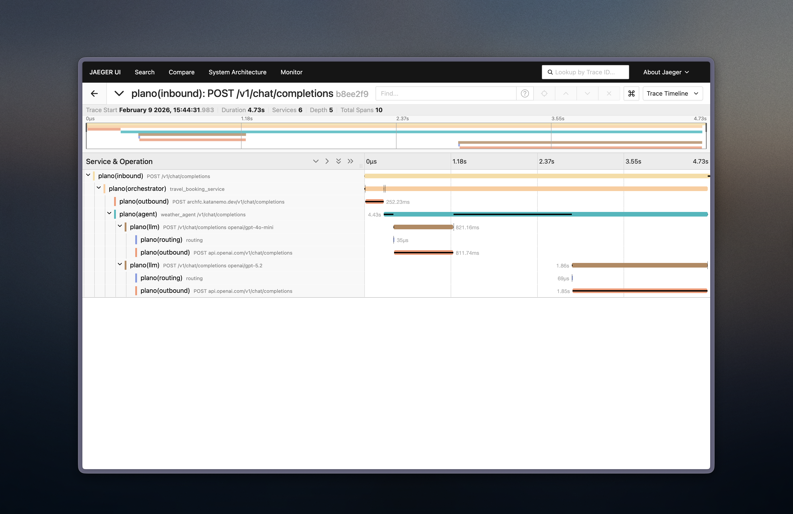

# Travel Booking Agent Demo

A multi-agent travel booking system demonstrating Plano's intelligent agent routing and orchestration capabilities. This demo showcases two specialized agents working together to help users plan trips with weather information and flight searches. All agent interactions are fully traced with OpenTelemetry-compatible tracing for complete observability.

## Overview

This demo consists of two intelligent agents that work together seamlessly:

- **Weather Agent** - Real-time weather conditions and multi-day forecasts for any city worldwide
- **Flight Agent** - Live flight information between airports with real-time tracking

All agents use Plano's agent orchestration LLM to intelligently route user requests to the appropriate specialized agent based on conversation context and user intent. Both agents run as Docker containers for easy deployment.

## Features

- **Intelligent Routing**: Plano automatically routes requests to the right agent
- **Conversation Context**: Agents understand follow-up questions and references
- **Real-Time Data**: Live weather and flight data from public APIs
- **Multi-Day Forecasts**: Weather agent supports up to 16-day forecasts
- **LLM-Powered**: Uses GPT-4o-mini for extraction and GPT-5.2 for responses
- **Streaming Responses**: Real-time streaming for better user experience

## Prerequisites

- Docker and Docker Compose
- [Plano CLI](https://docs.planoai.dev/get_started/quickstart.html#prerequisites) installed
- [OpenAI API key](https://platform.openai.com/api-keys)
- [FlightAware AeroAPI key](https://www.flightaware.com/aeroapi/portal)

> **Note:** You'll need to obtain a FlightAware AeroAPI key for live flight data. Visit [https://www.flightaware.com/aeroapi/portal](https://www.flightaware.com/aeroapi/portal) to get your API key.

## Quick Start

### 1. Set Environment Variables

Create a `.env` file or export environment variables:

```bash
export AEROAPI_KEY="your-flightaware-api-key"
export OPENAI_API_KEY="your OpenAI api key"
```

### 2. Start All Agents & Plano with Docker

```bash
docker compose up --build
```

This starts:
- Weather Agent on port 10510
- Flight Agent on port 10520
- Open WebUI on port 8080
- Plano Proxy on port 8001

### 4. Test the System

Use Open WebUI at http://localhost:8080

> **Note:** The Open WebUI may take a few minutes to start up and be fully ready. Please wait for the container to finish initializing before accessing the interface. Once ready, make sure to select the **gpt-5.2** model from the model dropdown menu in the UI.

## Example Conversations

### Multi-Agent Conversation
```
User: What's the weather in Istanbul?
Assistant: [Weather information]

User: Do they fly out from Seattle?
Assistant: [Flight information from Istanbul to Seattle]
```

The system understands context and pronouns, automatically routing to the right agent.

### Multi-Intent Single Query
```
User: What's the weather in Seattle, and do any flights go direct to New York?
Assistant: [Both weather_agent and flight_agent respond simultaneously]
  - Weather Agent: [Weather information for Seattle]
  - Flight Agent: [Flight information from Seattle to New York]
```

## Architecture

```
    User Request
         ↓
    Plano (8001)
     [Orchestrator]
         |
    ┌────┴──-──┐
    ↓          ↓
 Weather     Flight
  Agent       Agent
 (10510)     (10520)
 [Docker]    [Docker]
```

Each agent:
1. Extracts intent using GPT-4o-mini (with OpenTelemetry tracing)
2. Fetches real-time data from APIs
3. Generates response using GPT-5.2
4. Streams response back to user

Both agents run as Docker containers and communicate with Plano via `host.docker.internal`.

## Observability

This demo includes full OpenTelemetry (OTel) compatible distributed tracing to monitor and debug agent interactions:
The tracing data provides complete visibility into the multi-agent system, making it easy to identify bottlenecks, debug issues, and optimize performance.

For more details on setting up and using tracing, see the [Plano Observability documentation](https://docs.planoai.dev/guides/observability/tracing.html).


