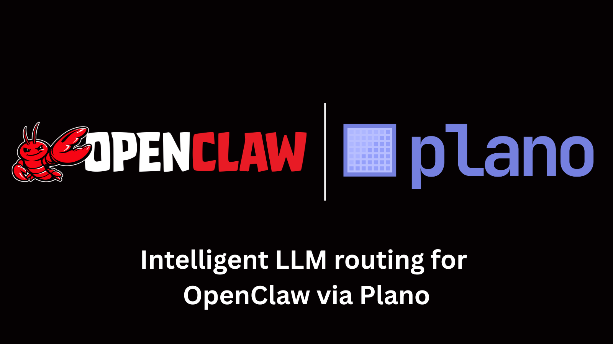

# OpenClaw + Plano: Smart Model Routing for Personal AI Assistants

<p align="center">
  
</p>

OpenClaw is an open-source personal AI assistant that connects to WhatsApp, Telegram, Slack, and Discord. By pointing it at Plano instead of a single LLM provider, every message is automatically routed to the best model — conversational requests go to Kimi K2.5 (cost-effective), while code generation, testing, and complex reasoning go to Claude (most capable) — with zero application code changes.

## Architecture

```
[WhatsApp / Telegram / Slack / Discord]
                |
        [OpenClaw Gateway]
         ws://127.0.0.1:18789
                |
        [Plano :12000]  ──────────────>  Kimi K2.5  (conversation, agentic tasks)
                |                           $0.60/M input tokens
                |──────────────────────>  Claude     (code, tests, reasoning)
```

Plano uses a [preference-aligned router](https://arxiv.org/abs/2506.16655) to analyze each prompt and select the best backend based on configured routing preferences.

## Prerequisites

- **Docker** running
- **Plano CLI**: `uv tool install planoai` or `pip install planoai`
- **OpenClaw**: `npm install -g openclaw@latest`
- **API keys**:
  - `MOONSHOT_API_KEY` — from [Moonshot AI](https://www..moonshot.ai/)
  - `ANTHROPIC_API_KEY` — from [Anthropic](https://console.anthropic.com/)

## Quick Start

### 1. Set Environment Variables

```bash
export MOONSHOT_API_KEY="your-moonshot-key"
export ANTHROPIC_API_KEY="your-anthropic-key"
```

### 2. Start Plano

```bash
cd demos/llm_routing/openclaw_routing
planoai up --service plano --foreground
```

### 3. Set Up OpenClaw

Install OpenClaw (requires Node >= 22):

```bash
npm install -g openclaw@latest
```

Install the gateway daemon and connect your messaging channels:

```bash
openclaw onboard --install-daemon
```

This installs the gateway as a background service (launchd on macOS, systemd on Linux). To connect messaging channels like WhatsApp or Telegram, see the [OpenClaw channel setup docs](https://docs.openclaw.ai/gateway/configuration).

Run `openclaw doctor` to verify everything is working.

### 4. Point OpenClaw at Plano

During the OpenClaw onboarding wizard, when prompted to choose an LLM provider:

1. Select **Custom OpenAI-compatible** as the provider
2. Set the base URL to `http://127.0.0.1:12000/v1`
3. Enter any value for the API key (e.g. `none`) — Plano handles auth to the actual providers
4. Set the context window to at least `128000` tokens

This registers Plano as OpenClaw's LLM backend. All requests go through Plano on port 12000, which routes them to Kimi K2.5 or Claude based on the prompt content.

If you've already onboarded, re-run the wizard to update the provider:

```bash
openclaw onboard --install-daemon
```

### 5. Test Routing Through OpenClaw

Send messages through any connected channel (WhatsApp, Telegram, Slack, etc.) and watch routing decisions in a separate terminal:

```bash
planoai logs --service plano | grep MODEL_RESOLUTION
```

Try these messages to see routing in action:

| # | Message (via your messaging channel) | Expected Route | Why |
|---|---------|---------------|-----|
| 1 | "Hey, what's up? Tell me something interesting." | **Kimi K2.5** | General conversation — cheap and fast |
| 2 | "Remind me tomorrow at 9am and ping Slack about the deploy" | **Kimi K2.5** | Agentic multi-step task orchestration |
| 3 | "Write a Python rate limiter with the token bucket algorithm" | **Claude** | Code generation — needs precision |
| 4 | "Write unit tests for the auth middleware, cover edge cases" | **Claude** | Testing & evaluation — needs thoroughness |
| 5 | "Compare WebSockets vs SSE vs polling for 10K concurrent users" | **Claude** | Complex reasoning — needs deep analysis |

OpenClaw's code doesn't change at all. It points at `http://127.0.0.1:12000/v1` instead of a direct provider URL. Plano's router analyzes each prompt and picks the right backend.


## Tracing

For fast dev/test cycles, Plano provides built-in tracing to visualize routing decisions and LLM interactions. Start the trace listener in a separate terminal:

```bash
planoai trace
```

Then send requests through OpenClaw. You'll see detailed traces showing:
- Which model was selected and why
- Token usage and latency for each request
- Complete request/response payloads

Learn more about tracing features and configuration in the [Plano tracing guide](https://docs.planoai.dev/guides/observability/tracing.html#tracing-with-the-cli).

## Cost Impact

For a personal assistant handling ~1000 requests/day with a 60/40 conversation-to-code split:

| Without Plano (all Claude) | With Plano (routed) |
|---|---|
| 1000 req x Claude pricing | 600 req x Kimi K2.5 + 400 req x Claude |
| ~$3.00/day input tokens | ~$0.36 + $1.20 = **$1.56/day** (~48% savings) |

Same quality where it matters (code, tests), lower cost where it doesn't (chat).

## Stopping the Demo

```bash
planoai down
```
