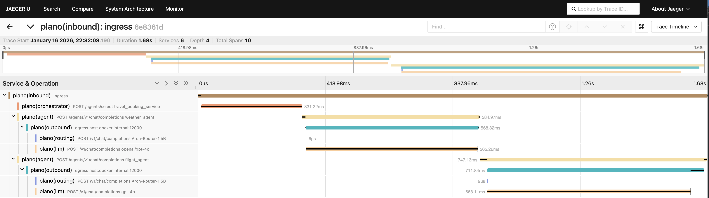

Travel Agents in CrewAI and LangChain - with Plano

**What you'll see:** A travel assistant that seamlessly combines flight booking (CrewAI) and weather forecasts (LangChain) in a single conversation - with unified routing, orchestration, moderation, and observability across both frameworks.

## The Problem

Building multi-agent systems today forces developers to:
- **Pick one framework** - can't mix CrewAI, LangChain, or custom agents easily
- **Write plumbing code** - authentication, request routing, error handling
- **Rebuild for changes** - want to swap frameworks? Start over
- **Limited observability** - no unified view across different agent frameworks

## Plano's Solution

Plano acts as a **framework-agnostic proxy and data plane** that:
- Routes requests to the right agent(s), in the right order (CrewAI, LangChain, or custom)
- Normalizes requests/responses across frameworks automatically
- Provides unified authentication, tracing, and logs
- Lets you mix and match frameworks without coupling, so that you can continue to innovate easily

## How To Run

### Prerequisites

1. **Install Plano CLI**
   ```bash
   uv tool install planoai
   ```

2. **Set Environment Variables**
   ```bash
   export OPENAI_API_KEY=your_key_here
   export AEROAPI_KEY=your_key_here  # Get your free API key at https://flightaware.com/aeroapi/
   ```

### Start the Demo

```bash
# From the demo directory
cd demos/use_cases/multi_agent_with_crewai_langchain

# Build and start all services
docker-compose up -d
```

This starts:
- **Plano** (ports 12000, 8001) - routing and orchestration
- **CrewAI Flight Agent** (port 10520) - flight search
- **LangChain Weather Agent** (port 10510) - weather forecasts
- **AnythingLLM** (port 3001) - chat interface
- **Jaeger** (port 16686) - distributed tracing

### Try It Out

1. **Open the Chat Interface**
   - Navigate to [http://localhost:3001](http://localhost:3001)
   - Create an account (stored locally)

2. **Ask Multi-Agent Questions**
   ```
   "What's the weather in San Francisco and can you find flights from Seattle to San Francisco?"
   ```

   Plano automatically:
   - Routes the weather part to the LangChain agent
   - Routes the flight part to the CrewAI agent
   - Combines responses seamlessly

3. **View Distributed Traces**
   - Open [http://localhost:16686](http://localhost:16686) (Jaeger UI)
   - See how requests flow through both agents

   

## Architecture

```
┌──────────────┐
│ AnythingLLM  │ (Chat Interface)
└──────┬───────┘
       │
       v
┌─────────────┐
│    Plano    │ (Orchestration & DataPlane)
└──────┬──────┘
       │
       ├──────────────┬──────────────┐
       v              v              v
┌────────────┐ ┌────────────┐ ┌──────────┐
│  CrewAI    │ │ LangChain  │ │  Jaeger  │
│   Flight   │ │  Weather   │ │ (Traces) │
│   Agent    │ │   Agent    │ └──────────┘
└────────────┘ └────────────┘
       ├──────────────├
       v              v
┌─────────────┐
│    Plano    │ (Proxy LLM calls)
└──────┬──────┘
```


## Travel Agents

### Flight Agent
- Framework: CrewAI
- Capabilities: Flight search, itinerary planning
- Tools: `resolve_airport_code`, `search_flights`
- Data Source: FlightAware AeroAPI

### Weather Agent
- Framework: LangChain
- Capabilities: Weather forecasts, conditions
- Tools: `get_weather_forecast`
- Data Source: Open-Meteo API

## Cleanup

```bash
docker-compose down
```

## Next Steps

- **Add your own agent** - any framework, just expose the OpenAI-compatible endpoint
- **Custom routing** - modify `config.yaml` to change agent selection logic
- **Production deployment** - see [Plano docs](https://docs.katanemo.com) for scaling guidance

## Learn More

- [Plano Documentation](https://docs.planoai.dev)
- [CrewAI Documentation](https://docs.crewai.com)
- [LangChain Documentation](https://python.langchain.com)
